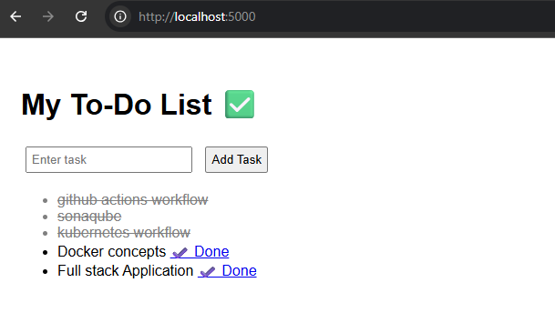

# Dockerized Flask To-Do Application with CI/CD & Kubernetes

## 📌 Project Overview

This project demonstrates a complete DevOps workflow using a simple Flask-based To-Do application.
The application is containerized using Docker, integrated with GitHub Actions for CI, and deployed on a Kubernetes cluster using Docker Desktop.

The goal of this project is to showcase practical understanding of:

- Containerization
- CI/CD pipelines
- Self-hosted GitHub Actions runner
- Kubernetes application deployment and operations

---

## 🛠️ Technologies Used

- Python (Flask)
- Docker & Docker Desktop
- GitHub Actions (CI/CD)
- Self-hosted GitHub Actions Runner
- Kubernetes (Docker Desktop cluster)
- kubectl

---

## 🚀 Application Features

- Simple web-based UI
- Add and view To-Do items
- Lightweight Flask backend
- Runs in Docker and Kubernetes environments

---

## Step 1: Docker Installation on Linux

```bash

sudo apt update

sudo apt install -y ca-certificates curl gnupg

sudo mkdir -p /etc/apt/keyrings

curl -fsSL https://download.docker.com/linux/ubuntu/gpg | sudo gpg --dearmor -o /etc/apt/keyrings/docker.gpg

echo "deb [arch=$(dpkg --print-architecture) signed-by=/etc/apt/keyrings/docker.gpg] https://download.docker.com/linux/ubuntu $(lsb_release -cs) stable" | sudo tee /etc/apt/sources.list.d/docker.list > /dev/null

sudo apt update

sudo apt install -y docker-ce docker-ce-cli containerd.io

docker --version

sudo systemctl status docker
```

## Step 2: Build Docker Image

docker build -t todo-docker-ui .

## Step 3: Run Container (Production Ready)

docker run -d -p 5000:5000 --name todo-ui-container --restart unless-stopped -v /full/path/to/templates:/app/templates todo-docker-ui

## Step 4: Access the Application

Open your browser: http://localhost:5000

Add tasks, mark done, and view completed tasks

## Step 5: Logs & Verification

Docker version: docker --version

Docker service status: sudo systemctl status docker

Container logs: docker logs todo-ui-container

## 🚀 CI/CD with Github Actions

- CI pipeline runs on every push and pull request to main

Steps include:

- Code checkout

- Dependency installation

- Application build/test

- A self-hosted runner was configured and successfully executed workflows

---
# Kubernetes Deployment

The same Docker image is deployed on a local Kubernetes cluster.
All Kubernetes manifests are located in:
- k8s/
Detailed Kubernetes steps are documented in:
- k8s/README.md

# Browser View


